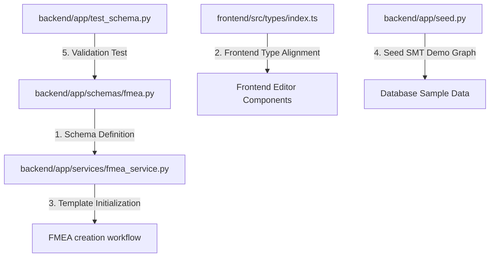

# PFMEA Data Structure Update Implementation Plan

> **For agentic workers:** REQUIRED SUB-SKILL: Use superpowers:subagent-driven-development (recommended) or superpowers:executing-plans to implement this plan task-by-task. Steps use checkbox (`- [ ]`) syntax for tracking.

**Goal:** Update the backend Pydantic schema and frontend TypeScript types of FMEA GraphNode to support all necessary attributes for AIAG-VDA 5th edition PFMEA, automatically initialize templates upon creation, and update the SMT demo seed data.

**Architecture:** Extend `GraphNodeSchema` in FastAPI/Pydantic and `GraphNode` in React/TypeScript with optional fields so that both DFMEA and PFMEA share the same flexible graph schema. When creating documents, base models will auto-generate initial nodes based on FMEA type.

**Tech Stack:** FastAPI, Pydantic, SQLAlchemy, PostgreSQL (JSONB), React, TypeScript.

---

## User Review Required

> [!NOTE]
> Backward compatibility is fully guaranteed. Existing records containing only traditional fields (`severity`, `occurrence`, `detection`) will continue to parse, load, and save without error, as all new fields default to `None` or appropriate baseline defaults.

> [!IMPORTANT]
> The FMEA creation logic will now inject a default starting node depending on `fmea_type`:
> - `PFMEA` -> `ProcessItem` (process item) node.
> - `DFMEA` -> `System` (system) node.

---

## Open Questions

None. The specification was reviewed and approved ("可以").

---

## Proposed Changes

We will modify four existing files and create one test verification script.



---

### Task 1: Backend Pydantic Schema Extension

**Files:**
- Modify: [fmea.py](file:///Users/sam/Documents/Code/OpenQMS/backend/app/schemas/fmea.py)

- [ ] **Step 1: Extend `GraphNodeSchema` in `backend/app/schemas/fmea.py`**

Modify the Pydantic schema in [fmea.py](file:///Users/sam/Documents/Code/OpenQMS/backend/app/schemas/fmea.py) to add PFMEA-specific optional attributes with default values. All new fields must have default values to remain 100% backward compatible:

```python
class GraphNodeSchema(BaseModel):
    id: str
    type: str
    name: str
    
    # 结构分析层级属性 (Step 2)
    process_number: str | None = None  # 仅用于 ProcessStep 的工序号，如 "OP30"
    classification: str | None = None  # 用于 ProcessWorkElement 的 4M 类型（Man/Machine/Material/Environment）或特性分类 (CC/SC)
    
    # 功能分析与要求属性 (Step 3)
    requirement: str | None = None     # 期望功能描述/技术要求
    specification: str | None = None   # 产品特性参数公差规格
    
    # 风险分析属性 (Step 4 & 5)
    severity: int = Field(default=0, ge=0, le=10)            # 综合严重度 (1-10)
    severity_plant: int | None = Field(default=None, ge=0, le=10)     # 本厂影响严重度 (1-10)
    severity_customer: int | None = Field(default=None, ge=0, le=10)  # 直接客户/下级工厂影响严重度 (1-10)
    severity_user: int | None = Field(default=None, ge=0, le=10)      # 最终用户影响严重度 (1-10)
    
    occurrence: int = Field(default=0, ge=0, le=10)          # 频度 (1-10)
    detection: int = Field(default=0, ge=0, le=10)           # 探测度 (1-10)
    
    # 优化措施跟进属性 (Step 6)
    responsible: str | None = None      # 措施责任人
    due_date: str | None = None         # 计划完成日期
    status: str | None = None           # 措施状态 (如 open / closed / in_progress)
    action_taken: str | None = None     # 实际采取的措施描述
    completion_date: str | None = None  # 实际完成日期
    
    revised_severity: int = Field(default=0, ge=0, le=10)    # 改进后严重度 (1-10)
    revised_occurrence: int = Field(default=0, ge=0, le=10)  # 改进后频度 (1-10)
    revised_detection: int = Field(default=0, ge=0, le=10)   # 改进后探测度 (1-10)
    revised_ap: str | None = None                            # 改进后的措施优先级 (H / M / L)
```

- [ ] **Step 2: Commit Backend Schema changes**

Run:
```bash
git add backend/app/schemas/fmea.py
git commit -m "schema: extend GraphNodeSchema with PFMEA and DFMEA optional fields"
```

---

### Task 2: Frontend TypeScript Types Extension

**Files:**
- Modify: [index.ts](file:///Users/sam/Documents/Code/OpenQMS/frontend/src/types/index.ts)

- [ ] **Step 1: Extend `GraphNode` in `frontend/src/types/index.ts`**

Modify the TypeScript interface in [index.ts](file:///Users/sam/Documents/Code/OpenQMS/frontend/src/types/index.ts) to match the backend model properties:

```typescript
export interface GraphNode {
  id: string;
  type: string;  // 节点类型：ProcessItem, ProcessStep, ProcessWorkElement 等
  name: string;  // 展示名称
  
  // 结构分析相关属性
  process_number?: string;   // 过程步骤工序号，如 "OP30"
  classification?: string;   // 作业要素的 4M 类别 (Man/Machine等) 或特殊特性分类 (CC/SC)
  
  // 功能分析与技术要求
  requirement?: string;      // 技术要求
  specification?: string;    // 产品特性公差参数
  
  // 风险评估数值
  severity: number;          // 综合严重度 (1-10)
  severity_plant?: number;   // 本厂影响严重度
  severity_customer?: number;// 直接客户/下级工厂影响严重度
  severity_user?: number;    // 最终用户影响严重度
  
  occurrence: number;        // 发生频度 (1-10)
  detection: number;         // 探测度 (1-10)
  
  // 建议优化与改进措施
  responsible?: string;      // 责任人
  due_date?: string;         // 计划完成日期
  status?: string;           // 状态
  action_taken?: string;     // 实际采取的措施描述
  completion_date?: string;  // 实际完成日期
  
  revised_severity?: number; // 改进后严重度
  revised_occurrence?: number;// 改进后频度
  revised_detection?: number; // 改进后探测度
  revised_ap?: string;       // 改进后措施优先级 (H / M / L)
}
```

- [ ] **Step 2: Commit Frontend Type changes**

Run:
```bash
git add frontend/src/types/index.ts
git commit -m "types: extend GraphNode interface with PFMEA optional properties"
```

---

### Task 3: Backend FMEA Creation Template Injection

**Files:**
- Modify: [fmea_service.py](file:///Users/sam/Documents/Code/OpenQMS/backend/app/services/fmea_service.py)

- [ ] **Step 1: Import uuid in `fmea_service.py` if not present and update `create_fmea`**

Modify `create_fmea` function in [fmea_service.py](file:///Users/sam/Documents/Code/OpenQMS/backend/app/services/fmea_service.py) to automatically initialize template starting nodes based on `fmea_type`:

```python
    fmea_id = uuid.uuid4()
    
    # Initialize templates based on FMEA type
    graph_data = {"nodes": [], "edges": []}
    if fmea_type == "PFMEA":
        graph_data["nodes"].append({
            "id": f"pi_{uuid.uuid4().hex[:8]}",
            "type": "ProcessItem",
            "name": "新建过程项目",
            "severity": 0,
            "occurrence": 0,
            "detection": 0
        })
    elif fmea_type == "DFMEA":
        graph_data["nodes"].append({
            "id": f"sys_{uuid.uuid4().hex[:8]}",
            "type": "System",
            "name": "新建系统",
            "severity": 0,
            "occurrence": 0,
            "detection": 0
        })

    fmea = FMEADocument(
        fmea_id=fmea_id,
        title=title,
        document_no=document_no,
        fmea_type=fmea_type,
        created_by=user_id,
        updated_by=user_id,
        graph_data=graph_data,  # Inject template graph
    )
```

- [ ] **Step 2: Commit Service changes**

Run:
```bash
git add backend/app/services/fmea_service.py
git commit -m "service: automatically initialize default root nodes on FMEA creation"
```

---

### Task 4: SMT Seeding Data Update

**Files:**
- Modify: [seed.py](file:///Users/sam/Documents/Code/OpenQMS/backend/app/seed.py)

- [ ] **Step 1: Replace `SAMPLE_GRAPH` in `backend/app/seed.py`**

Replace the old planar process mock graph with the new 7-step fully compliant SMT PFMEA diagram in [seed.py](file:///Users/sam/Documents/Code/OpenQMS/backend/app/seed.py):

```python
SAMPLE_GRAPH = {
    "nodes": [
        {"id": "pi_1", "type": "ProcessItem", "name": "SMT焊接生产线", "severity": 0, "occurrence": 0, "detection": 0},
        {"id": "ps_1", "type": "ProcessStep", "name": "SMT元器件贴装", "process_number": "OP10", "severity": 0, "occurrence": 0, "detection": 0},
        {"id": "we_1", "type": "ProcessWorkElement", "name": "高速贴片机", "classification": "Machine", "severity": 0, "occurrence": 0, "detection": 0},
        {"id": "pif_1", "type": "ProcessItemFunction", "name": "完成电路板SMT焊接与元器件组装", "severity": 0, "occurrence": 0, "detection": 0},
        {"id": "psf_1", "type": "ProcessStepFunction", "name": "准确贴装电子元器件", "specification": "元器件贴装偏移度 <= 0.05mm", "severity": 0, "occurrence": 0, "detection": 0},
        {"id": "wef_1", "type": "ProcessWorkElementFunction", "name": "设备提供适宜且稳定的贴装压力", "requirement": "贴装压力 3.0±0.5N", "severity": 0, "occurrence": 0, "detection": 0},
        {"id": "fe_1", "type": "FailureEffect", "name": "电控板功能丧失，导致整车无法启动报警", "severity": 8, "severity_plant": 4, "severity_customer": 8, "severity_user": 8, "occurrence": 0, "detection": 0},
        {"id": "fm_1", "type": "FailureMode", "name": "元器件贴装偏移", "severity": 0, "occurrence": 0, "detection": 0},
        {"id": "fc_1", "type": "FailureCause", "name": "贴装吸嘴磨损导致压力设定偏小", "severity": 0, "occurrence": 4, "detection": 0},
        {"id": "pc_1", "type": "PreventionControl", "name": "开机吸嘴压力自动零点校准与设备预防性维护", "severity": 0, "occurrence": 0, "detection": 0},
        {"id": "dc_1", "type": "DetectionControl", "name": "贴装后在线 3D-AOI 光学检测仪", "severity": 0, "occurrence": 0, "detection": 3},
        {
            "id": "ra_1",
            "type": "RecommendedAction",
            "name": "引入吸嘴压力闭环传感器进行实时监测与自适应补偿",
            "responsible": "张工",
            "due_date": "2026-06-15",
            "status": "open",
            "action_taken": "",
            "completion_date": "",
            "severity": 0,
            "occurrence": 0,
            "detection": 0,
            "revised_severity": 0,
            "revised_occurrence": 0,
            "revised_detection": 0,
            "revised_ap": ""
        }
    ],
    "edges": [
        {"source": "pi_1", "target": "ps_1", "type": "HAS_PROCESS_STEP"},
        {"source": "ps_1", "target": "we_1", "type": "HAS_WORK_ELEMENT"},
        {"source": "pi_1", "target": "pif_1", "type": "HAS_FUNCTION"},
        {"source": "ps_1", "target": "psf_1", "type": "HAS_FUNCTION"},
        {"source": "we_1", "target": "wef_1", "type": "HAS_FUNCTION"},
        {"source": "pif_1", "target": "psf_1", "type": "FUNCTION_MAPPED_TO"},
        {"source": "psf_1", "target": "wef_1", "type": "FUNCTION_MAPPED_TO"},
        {"source": "psf_1", "target": "fm_1", "type": "HAS_FAILURE_MODE"},
        {"source": "fm_1", "target": "fe_1", "type": "EFFECT_OF"},
        {"source": "fc_1", "target": "fm_1", "type": "CAUSE_OF"},
        {"source": "fc_1", "target": "pc_1", "type": "PREVENTED_BY"},
        {"source": "fc_1", "target": "dc_1", "type": "DETECTED_BY"},
        {"source": "fc_1", "target": "ra_1", "type": "OPTIMIZED_BY"}
    ]
}
```

- [ ] **Step 2: Commit Seeding changes**

Run:
```bash
git add backend/app/seed.py
git commit -m "seed: upgrade SAMPLE_GRAPH to fully compliant AIAG-VDA 7-step PFMEA SMT process"
```

---

### Task 5: Automated Verification Script

**Files:**
- Create: [test_schema.py](file:///Users/sam/Documents/Code/OpenQMS/backend/app/test_schema.py)

- [ ] **Step 1: Write verification script `backend/app/test_schema.py`**

Create [test_schema.py](file:///Users/sam/Documents/Code/OpenQMS/backend/app/test_schema.py) to exercise and test schema validation, defaults, and backward compatibility:

```python
import sys
from pydantic import ValidationError
from app.schemas.fmea import GraphNodeSchema, GraphDataSchema

def test_graph_node_schema_backward_compatibility():
    # 1. Test traditional node (backward compatibility)
    node_data = {
        "id": "n1",
        "type": "Process",
        "name": "SMT贴装",
        "process_number": "OP10",
        "severity": 7,
        "occurrence": 4,
        "detection": 3
    }
    node = GraphNodeSchema(**node_data)
    assert node.id == "n1"
    assert node.classification is None
    assert node.severity_plant is None
    assert node.revised_severity == 0
    print("Pass: Traditional backward compatible schema validation")

def test_graph_node_schema_pfmea_fields():
    # 2. Test PFMEA specific node with 3-segment severity
    node_data = {
        "id": "fe_1",
        "type": "FailureEffect",
        "name": "电控板功能丧失",
        "severity": 8,
        "severity_plant": 4,
        "severity_customer": 8,
        "severity_user": 8,
        "occurrence": 0,
        "detection": 0,
        "responsible": "张工",
        "status": "open"
    }
    node = GraphNodeSchema(**node_data)
    assert node.severity == 8
    assert node.severity_plant == 4
    assert node.severity_customer == 8
    assert node.severity_user == 8
    assert node.responsible == "张工"
    assert node.status == "open"
    print("Pass: New PFMEA 3-segment severity schema validation")

def test_invalid_range_validation():
    # 3. Test validation constraint boundaries (severity ge 0 le 10)
    node_data = {
        "id": "fe_1",
        "type": "FailureEffect",
        "name": "电控板功能丧失",
        "severity": 12,  # Invalid
        "occurrence": 0,
        "detection": 0
    }
    try:
        GraphNodeSchema(**node_data)
        assert False, "Should have failed validation"
    except ValidationError as e:
        print("Pass: Invalid range constraint caught successfully")

if __name__ == "__main__":
    try:
        test_graph_node_schema_backward_compatibility()
        test_graph_node_schema_pfmea_fields()
        test_invalid_range_validation()
        print("\nAll schema validations passed perfectly!")
        sys.exit(0)
    except Exception as e:
        print(f"\nTest failed: {e}")
        sys.exit(1)
```

- [ ] **Step 2: Run verification script**

Run:
```bash
python -m app.test_schema
```
Expected: All schema validations passed perfectly!

- [ ] **Step 3: Commit verification script**

Run:
```bash
git add backend/app/test_schema.py
git commit -m "test: add verification script for new PFMEA node schemas"
```

---

## Verification Plan

### Automated Tests
- Run `python -m app.test_schema` inside `backend/app/` (or via docker) to ensure the validation logic passes.

### Manual Verification
- We can reset and seed the database to make sure the seeded SMT PFMEA diagram inserts correctly.
